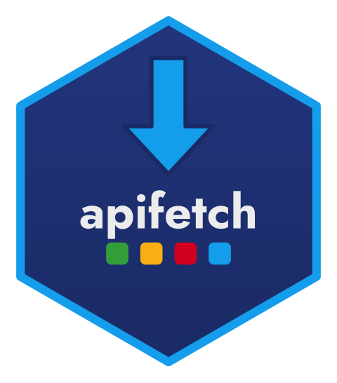

<!-- README.md is generated from README.Rmd. Please edit that file -->

```{r, include = FALSE}
knitr::opts_chunk$set(
  collapse = TRUE,
  comment = "#>",
  fig.path = "man/figures/README-",
  out.width = "100%"
)
```

# apifetch 

<!-- badges: start -->
<!-- badges: end -->

`apifetch` is a small, dependency-light toolkit for talking to
token-authenticated REST APIs from R. It handles three recurring chores:

1. **Token management** — store/get/remove/list tokens in process environment
   variables (never written to disk), namespaced per service.
2. **Request building** — pluggable **authentication** and **pagination**
   strategies, bundled into a reusable API *profile*.
3. **Data retrieval** — fetch one page, or fetch everything in chunks
   row-bound into a single tibble.

It is the generic engine extracted from the
[BigDataPE](https://github.com/StrategicProjects/BigDataPE) package; BigDataPE is now just
one *use case* (see `vignette("bigdatape")`). A Python sibling lives at
[apifetch-py](https://github.com/StrategicProjects/apifetch-py).

## Installation

```r
# install.packages("pak")
pak::pak("StrategicProjects/apifetch")
```

## Usage

```r
library(apifetch)

# 1. Describe the API once: where, how to authenticate, how to paginate.
api <- af_api(
  endpoint   = "https://api.example.com/v1/search",
  service    = "Example",
  auth       = af_auth_bearer(),          # "Authorization: Bearer <token>"
  pagination = af_paginate_offset("query")
)

# 2. Store a token (kept only in this session's environment).
af_store_token("reports", "my-secret-token", service = "Example")

# 3. Fetch.
one_page <- af_fetch(api, "reports", limit = 50)
everything <- af_fetch_all(api, "reports", chunk_size = 1000)
```

### Strategies

Authentication: `af_auth_bearer()`, `af_auth_raw()`, `af_auth_header()`,
`af_auth_query()`.

Pagination: `af_paginate_offset(where = "header" | "query")`,
`af_paginate_none()`.
```
